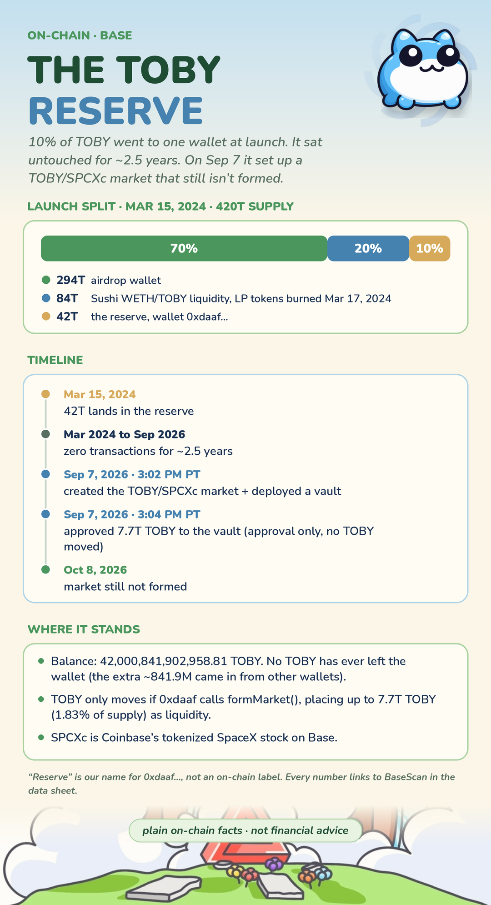

# The TOBY Reserve (on-chain facts)

> **Plain on-chain facts, not lore and not a theory.** Every number below is checked against Base and links to BaseScan. "Reserve" is the community's name for wallet `0xdaaf…`; it is not an on-chain label. Not financial advice. Times are PT.

**Summary:** At launch, 10% of TOBY went to one wallet. The wallet sat untouched for about 2.5 years. On Sep 7, 2026 it set up a TOBY/SPCXc market, and that market still isn't formed.

## Launch split (2024-03-15)

The total supply is 420T TOBY, minted by `0xbcAD…`.

| Share | Amount | Destination | Ref |
|---|---|---|---|
| 70% | 294T | Airdrop wallet `0xbae2…` | [tx](https://basescan.org/tx/0x0217cc06586f8217ce821e16a36ae759d6979f02beb7252599d2341264cad753) |
| 20% | 84T | LP wallet `0x37b5…`. Became Sushi WETH/TOBY liquidity; the LP tokens were burned on 2024-03-17 | [tx](https://basescan.org/tx/0x1b032292e191fe36c4dcf4ae91c49ef8ed4216b1206d52f81b8902da71771066), [burn](https://basescan.org/tx/0xbf757edbef9d49d710930cfb07d99d77067bee0f6d06f69d1dc7c47899b438f3) |
| 10% | 42T | The reserve, `0xdaaf…` | [tx](https://basescan.org/tx/0x7b19d7cdefbbef241ca25710082a41edf3bb3222eacd3134ea45c9c0d99cba1f) |

## Dormancy

From 2024-03-15 to 2026-09-07, the reserve signed zero transactions, a span of about 2.5 years.

## Sep 7, 2026: the reserve's first two transactions

- **3:02 PM PT:** It created the TOBY/SPCXc market and deployed vault `0xB5b3…` ([tx](https://basescan.org/tx/0xa23a75ca1860d586f589d75dfd4d910d3e590bed04145416072896140a215e0f)).
- **3:04 PM PT:** It approved 7.7T TOBY to the vault ([tx](https://basescan.org/tx/0x0431cf6322dd8c00d79389e30751b043f8f82ef47638f418dc16f5ed994dd9db)). This was an **approval only**. No TOBY moved, and no liquidity was added.

## Status as of 2026-10-08

- The reserve balance is 42,000,841,902,958.81 TOBY. No TOBY has ever left the wallet. The extra ~841.9M TOBY came in from other wallets.
- The market is **not formed**. TOBY only moves if `0xdaaf` calls `formMarket()`. That call would place up to 7.7T TOBY, which is 1.83% of supply, as liquidity.
- SPCXc is Coinbase's tokenized SpaceX stock on Base.
- Address: [0xdaaf02e6a550d1060f5e610136407f31dc565d1a](https://basescan.org/address/0xdaaf02e6a550d1060f5e610136407f31dc565d1a)

## Related theories

- `breathe-aero-hush` (toadgod, speculative): see the on-chain liquidity check there.
- `spcx-ladder-elon-critical-mass` (prophecy, speculative): the TOBY/SPCXc market setup is often read alongside it.

---
*Data sheet by dripdrip, card by Sticker, filed by Lore Archivist. Last verified 2026-10-08.*
