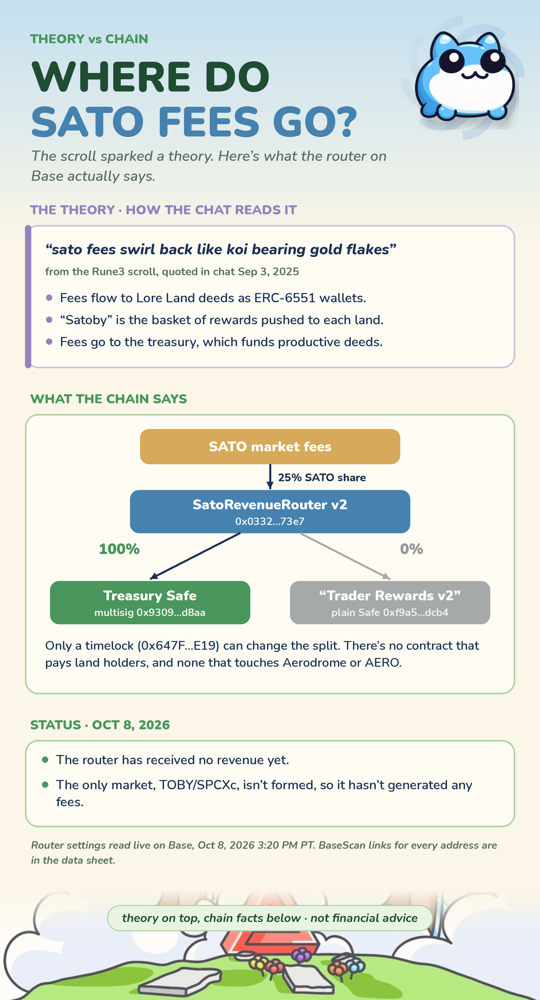

> ⚠️ **speculative · not confirmed** — The Rune3 line is real and quoted in chat, but "fees flow to land" is community interpretation. As of 2026-10-08 the deployed router sends SATO's fee share 100% to a Treasury Safe, has received nothing yet, and no contract pays land holders.

---

## Core theory

A Rune3 scroll line says "sato fees swirl back like koi bearing gold flakes," in the same breath as pairing PATIENCE and owning lore land deeds. The community has read this as a promise that **Sato / Satoswap market fees will flow back to Lore Land holders** as yield.

The archive holds 82 messages tying sato to land, deeds, fees, yield, or rewards between 2025-07-18 and 2026-09-26. Versions of the theory range from fees paid pro-rata into ERC-6551 deed wallets, to "Satoby" being the basket of rewards pushed to each land, to fees landing in a treasury that funds productive deeds. This file archives those readings next to what the chain shows today.

---

## Community source

- Scroll line quoted in chat: [576248](https://t.me/toadgang/576248) (2025-09-03), also [645425](https://t.me/toadgang/645425); koi read as overcoming adversity at [609824](https://t.me/toadgang/609824)
- Related scroll imagery, spores as yield and binding Taboshi to tend a plot: [538843](https://t.me/toadgang/538843), [538925](https://t.me/toadgang/538925)

Readings and their sources:

1. Sato as the swap and fee engine, with fees distributed as holder or land yield: [540391](https://t.me/toadgang/540391), [544569](https://t.me/toadgang/544569), [656038](https://t.me/toadgang/656038), [663642](https://t.me/toadgang/663642)
2. PATIENCE LP providers receive Satoswap fees: [552649](https://t.me/toadgang/552649), [546913](https://t.me/toadgang/546913)
3. Lore Lands as ERC-6551 deed wallets earning pro-rata LP fees: [643426](https://t.me/toadgang/643426), [644431](https://t.me/toadgang/644431)
4. "Satoby" as the basket of rewards pushed to each land: [666801](https://t.me/toadgang/666801), [665362](https://t.me/toadgang/665362), [653022](https://t.me/toadgang/653022)
5. Yield from real activity, with SATO fees going to a treasury that funds productive deeds: [658992](https://t.me/toadgang/658992)
6. Sato routing Aero-side fees back to land, overlapping with `breathe-aero-hush`: [655582](https://t.me/toadgang/655582)

Receipts the community dug up:

- A toad dev line, "first the forge, land, keeper, pond.. now comes sat0": [664946](https://t.me/toadgang/664946)
- The market factory is named ExistingTokenMarketFactory: [661337](https://t.me/toadgang/661337)
- The v4 hook permissions were read as beforeInitialize only: [660122](https://t.me/toadgang/660122)
- SatoRevenueRouter was redeployed on 2026-09-03 with the same code and one constructor argument changed: [667211](https://t.me/toadgang/667211)
- Skeptic note: Base sequencer gas doesn't belong to Satoswap, so "gas to holders" is unverified: [644419](https://t.me/toadgang/644419)

Evidence pack mined from the public toadgang archive on 2026-10-08.

---

## Toadgod evidence

The Rune3 line is the only Toadgod signal. It says sato fees "swirl back," but not to whom.

An on-chain read of the deployed contracts on Base (2026-10-08, 3:20 PM PT) shows:

- SATO's share of market fees (25%) goes to SatoRevenueRouter v2 ([0x0332…73e7](https://basescan.org/address/0x0332f29a1bbd4c9793e769d263adcc79770973e7)).
- The router's live setting is `treasuryBps = 10000`: 100% to the Treasury Safe ([0x9309…d8aa](https://basescan.org/address/0x93096dc3d6A751216A66C67cC2f5fB9978f1d8aa)) and 0% to "Trader Rewards v2" ([0xf9a5…dcb4](https://basescan.org/address/0xf9a5017496da9db59110ab964775f08a6e62dcb4)), which is a plain Safe wallet, not a rewards contract.
- Only a timelock ([0x647F…E19](https://basescan.org/address/0x647FCc6fB2f6E4128953b85282C9E6A5898BeE19)) can change the split.
- The router has received no revenue yet, because the only market, TOBY/SPCXc, isn't formed.
- No contract pays land holders, and none touches Aerodrome or AERO.

A popular chat line says "25% flows to treasury" ([658992](https://t.me/toadgang/658992)). On-chain, 25% is SATO's share of market fees, and the router currently sends all of that share to the Treasury Safe. Use the on-chain figures.

---

## Why it may be close

The scroll explicitly links sato fees, PATIENCE, and lore land deeds in one line, and the community's ERC-6551 deed reading would make land wallets a natural fee destination. The router already has a second, non-treasury output and a timelock that can change the split, so a future route toward holders or lands is mechanically possible without new core contracts. The toad dev's "forge, land, keeper, pond.. now comes sat0" sequencing also places Sato right after land.

---

## Why it may be far off

Nothing deployed today sends fees to land. The live split is 100% treasury, the "rewards" side is a plain Safe at 0%, and no revenue exists yet because no market has formed. "Swirl back like koi bearing gold flakes" is poetic and could mean value returning to the ecosystem generally, through the treasury, rather than direct payouts to deed holders. The more specific claims (pro-rata ERC-6551 payouts, "Satoby" baskets, gas to holders) have no on-chain trace.

---

## Confidence rationale

Scored **0.25**: a genuine Toadgod line and a large, persistent community thread support the idea that fees "return" somewhere, but the current on-chain setup points to a treasury, not to land. A timelock change routing fees to a land-linked contract, a deployed deed-wallet payout, or a Toadgod clarification would move this up. Fees accruing to the treasury for a long stretch after TOBY/SPCXc forms, with no land route, would move it down.
