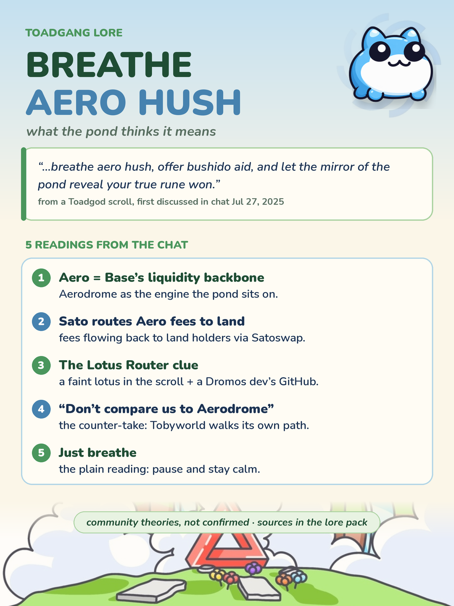

> ⚠️ **speculative · not confirmed** — The scroll line is real and quoted in chat, but every reading of "aero" and "hush" is community interpretation. There is no confirmed Aero or Aerodrome partnership in the archive, and an onchain check found no TOBY or SATO liquidity routed through Aerodrome.

---

## Core theory

A Toadgod scroll contains the line "breathe aero hush, offer bushido aid, and let the mirror of the pond reveal your true rune won." Since the first chat breakdown on 2025-07-27, toadgang has argued over what "aero hush" points to. The archive holds 553 messages mentioning aero, 275 mentioning hush, and 41 mentioning both.

The leading reading is that **Aero means Aerodrome**, the main liquidity venue on Base, and that the line hints at Tobyworld liquidity, pairing, or locking there. A follow-on reading says **Sato / Satoswap will route Aero-side fees back to land holders**. Smaller threads read a "hush protocol" gate waiting on Base thresholds, a **Lotus Router** clue (a Dromos developer's GitHub interest plus a faint lotus in the scroll), and Hush as a land keeper or flight image.

Two readings push the other way: a **"don't compare Tobyworld to Aerodrome"** counter-take, and the **plain reading** that the line simply says to pause and breathe through volatility. This file archives the debate and its receipts, not a conclusion.

---

## Community source

- First chat discussion, 2025-07-27: [551359](https://t.me/toadgang/551359), [551472](https://t.me/toadgang/551472)
- Full scroll quote reposted by Lars: [602823](https://t.me/toadgang/602823). Lars dates the scroll "27th July 2024," but archive discussion starts 2025-07-27, so the scroll's original date is unconfirmed.

Readings and their sources:

1. Aero as Aerodrome, Base's liquidity backbone: [556747](https://t.me/toadgang/556747), [638983](https://t.me/toadgang/638983), [631434](https://t.me/toadgang/631434)
2. A hint at LP pairing and locking: [551412](https://t.me/toadgang/551412), [565981](https://t.me/toadgang/565981)
3. A "hush protocol" gate waiting on Base/Aero thresholds: [568663](https://t.me/toadgang/568663)
4. Sato / Satoswap routing Aero fees to land holders: [655582](https://t.me/toadgang/655582), [652534](https://t.me/toadgang/652534), [664811](https://t.me/toadgang/664811). The Satoswap thread also references @ahushbeforedawn ([652534](https://t.me/toadgang/652534)).
5. Lotus Router and Dromos thread: a Dromos dev's GitHub showed interest in a "Lotus Router," with a faint lotus behind Satoswap on the scroll ([633220](https://t.me/toadgang/633220)). Follow-ons: "dromos" as Greek for a long entrance passage, tied to "the coming gate" ([649528](https://t.me/toadgang/649528)); DromosLabs and Tobyworld parallels ([588059](https://t.me/toadgang/588059)); DromosLabs liking Tobyworld posts on X ([649483](https://t.me/toadgang/649483), [667135](https://t.me/toadgang/667135)); and the Dromos Labs CEO being a core Aerodrome contributor ([667134](https://t.me/toadgang/667134)).
6. Hush as land keeper / flight imagery: [656887](https://t.me/toadgang/656887)
7. Counter-reading, "don't compare Tobyworld to Aerodrome," posted a day after a large X post linking them: [639252](https://t.me/toadgang/639252), [669929](https://t.me/toadgang/669929), [626719](https://t.me/toadgang/626719)
8. Mindfulness reading, pause and breathe: [626730](https://t.me/toadgang/626730), [632158](https://t.me/toadgang/632158)

Evidence pack mined from the public toadgang archive on 2026-10-08.

---

## Toadgod evidence

The scroll line itself is the only Toadgod signal, quoted in chat at [602823](https://t.me/toadgang/602823). Toadgod has not said what "aero" or "hush" refers to, and has not named Aerodrome, Velodrome, or Dromos.

An onchain check by the community (2026-10-08) found no Aerodrome routing in traced TOBY or SATO contracts: TOBY launch liquidity went to a Sushi pool, PATIENCE trades on a Uniswap V2-style pool, and the SATO TOBY/SPCXc market is built on Uniswap v4. Only dust-level AERO appeared in a couple of wallets.

A follow-up check on the Dromos thread (2026-10-08) found that the Lotus Router is a public open-source router published by [mix-protocol](https://github.com/mix-protocol/lotus-router), not a Dromos product. Dromos Labs' [public GitHub](https://github.com/dromos-labs) lists only its two MetaDEX repos. This doesn't rule out a Dromos developer's interest in it, but none of the traced TOBY or SATO contracts and wallets touch an Aerodrome or Dromos contract, so the Dromos ties are social signals only. Whether a copy of the Lotus Router is deployed on Base has not been checked yet.

> ⚠️ **Scam warning:** a spam token named "Claim on: rewards.aerodrome-network.com" was sent to the reserve wallet. It is a phishing lure, not an Aerodrome link. Do not visit that site.

---

## Why it may be close

"Aero" is an unusual word to drop into a scroll, and Aerodrome is the dominant liquidity venue on Base, where Toby lives. The Lotus Router thread gives a second, independent thread pointing toward the Dromos ecosystem. If Satoswap ever needs deep Base liquidity or fee routing, Aerodrome is a natural venue, so the line could be foreshadowing rather than describing the present.

---

## Why it may be far off

Nothing onchain today touches Aerodrome; Toby's actual liquidity history runs through Sushi and Uniswap-style pools. The scroll reads naturally as poetry ("breathe," "hush," "bushido," "mirror of the pond"), which supports the plain calm-down reading. The "don't compare us to Aerodrome" counter-take appeared right after an X post pushed the link, which suggests some of the Aero reading is amplification rather than signal. The scroll's original date is also unsettled.

---

## Confidence rationale

Scored **0.3**: real and persistent community discussion with a genuine Toadgod line at its center, but the Aerodrome reading has no Toadgod confirmation and current onchain evidence points away from it. A Toadgod clarification, an Aerodrome pool or gauge for TOBY or SATO, or Satoswap fee routing through the Dromos stack would move this up; continued absence of any Aero footprint after Satoswap launches would move it down.
